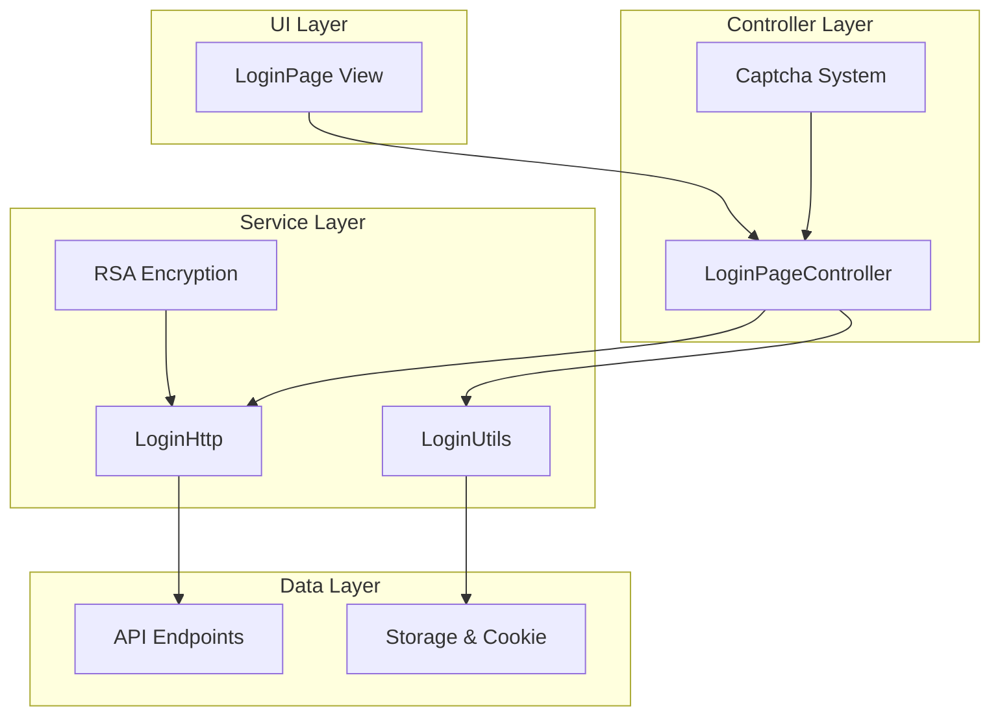

# PiliPala 登录功能技术文档

## 概述

PiliPala 是一个基于 Flutter 的哔哩哔哩第三方客户端，实现了完整的用户登录系统。该系统支持多种登录方式，包括密码登录、短信验证码登录、二维码登录等，并采用了 RSA 加密、极验验证码等安全机制。

## 系统架构

### 核心组件



### 文件结构

- `lib/pages/login/` - 登录页面相关
  - `view.dart` - UI 界面实现 [1](#1-0) 
  - `controller.dart` - 业务逻辑控制器 [2](#1-1) 
- `lib/http/login.dart` - 登录 API 服务 [3](#1-2) 
- `lib/utils/login.dart` - 登录工具类 [4](#1-3) 
- `lib/http/api.dart` - API 端点定义 [5](#1-4) 

## 登录方式详解

### 1. 密码登录

#### Web 端密码登录流程

1. **获取加密密钥**
   ```dart
   static Future getWebKey() async {
     var res = await Request().get(Api.getWebKey,
         data: {'disable_rcmd': 0, 'local_id': LoginUtils.generateBuvid()});
     // 返回 hash 和 publicKey
   } [6](#1-5) 
   ```

2. **RSA 加密密码**
   ```dart
   dynamic publicKey = RSAKeyParser().parse(key);
   String passwordEncryptyed = Encrypter(RSA(publicKey: publicKey))
       .encrypt(rhash + passwordTextController.text)
       .base64; [7](#1-6) 
   ```

3. **发送登录请求**
   ```dart
   var res = await LoginHttp.loginInByWebPwd(
     username: tel,
     password: passwordEncryptyed,
     token: captchaData.token!,
     challenge: captchaData.geetest!.challenge!,
     validate: captchaData.validate!,
     seccode: captchaData.seccode!,
   ); [8](#1-7) 
   ```

#### App 端密码登录

App 端密码登录复用了 Web 端的加密密钥获取逻辑 [9](#1-8) ，但使用不同的 API 端点。

### 2. 短信验证码登录

#### 极验验证码集成

```dart
Future getCaptcha(oncall) async {
  var result = await LoginHttp.queryCaptcha();
  if (result['status']) {
    CaptchaDataModel captchaData = result['data'];
    var registerData = Gt3RegisterData(
      challenge: captchaData.geetest!.challenge,
      gt: captchaData.geetest!.gt!,
      success: true,
    );
    // 处理验证码回调
    captcha.addEventHandler(onResult: (Map<String, dynamic> message) async {
      if (message["code"] == "1") {
        captchaData.validate = message['result']['geetest_validate'];
        captchaData.seccode = message['result']['geetest_seccode'];
        oncall(captchaData);
      }
    });
  }
} [10](#1-9) 
```

#### 发送短信验证码

```dart
static Future sendWebSmsCode({
  int? cid,
  required int tel,
  required String token,
  required String challenge,
  required String validate,
  required String seccode,
}) async {
  Map data = {
    'cid': cid,
    'tel': tel,
    "source": "main_web",
    'token': token,
    'challenge': challenge,
    'validate': validate,
    'seccode': seccode,
  };
  var res = await Request().post(Api.webSmsCode, data: formData);
} [11](#1-10) 
```

#### 验证码登录

```dart
void loginInByCode() async {
  var res = await LoginHttp.loginInByWebSmsCode(
    cid: 86,
    tel: tel,
    code: webSmsCode,
    captchaKey: captchaKey,
  );
  if (res['status']) {
    await LoginUtils.confirmLogin('', null);
  }
} [12](#1-11) 
```

### 3. 二维码登录

#### 生成二维码

```dart
Future getWebQrcode() async {
  var res = await LoginHttp.getWebQrcode();
  validSeconds.value = 180;
  if (res['status']) {
    qrcodeKey = res['data']['qrcode_key'];
    // 设置定时器轮询登录状态
    validTimer = Timer.periodic(const Duration(seconds: 1), (validTimer) {
      if (validSeconds.value > 0) {
        validSeconds.value--;
        queryWebQrcodeStatus();
      } else {
        getWebQrcode(); // 重新生成二维码
        validTimer.cancel();
      }
    });
  }
} [13](#1-12) 
```

#### 轮询登录状态

```dart
Future queryWebQrcodeStatus() async {
  var res = await LoginHttp.queryWebQrcodeStatus(qrcodeKey);
  if (res['status']) {
    await LoginUtils.confirmLogin('', null);
    validTimer?.cancel();
    Get.back();
  }
} [14](#1-13) 
```

### 4. WebView 登录

提供浏览器登录作为备选方案 [15](#1-14) 。

## 安全机制

### 1. RSA 加密

密码在传输前使用 RSA 公钥加密，确保密码安全 [16](#1-15) 。

### 2. 极验验证码

集成极验验证码防止自动化攻击 [10](#1-9) 。

### 3. 设备标识

生成唯一的 buvid 作为设备标识 [17](#1-16) 。

## 登录成功处理

```dart
static confirmLogin(url, controller) async {
  try {
    await SetCookie.onSet(); // 设置 Cookie
    final result = await UserHttp.userInfo(); // 获取用户信息
    if (result['status'] && result['data'].isLogin) {
      // 缓存用户信息
      Box userInfoCache = GStrorage.userInfo;
      await userInfoCache.put('userInfoCache', result['data']);
      
      // 更新各页面登录状态
      final HomeController homeCtr = Get.find<HomeController>();
      homeCtr.updateLoginStatus(true);
      homeCtr.userFace.value = result['data'].face;
      
      await LoginUtils.refreshLoginStatus(true);
    }
  } catch (e) {
    // 错误处理
  }
} [18](#1-17) 
```

## API 端点

| 功能 | 端点 | 方法 |
|------|------|------|
| Web 密码登录 | `/x/passport-login/web/login` | POST [19](#1-18)  |
| 获取验证码 | `/x/passport-login/captcha` | GET |
| 发送短信验证码 | `/x/passport-login/web/sms/send` | POST |
| 短信验证码登录 | `/x/passport-login/web/login/sms` | POST |
| 生成二维码 | `/x/passport-login/web/qrcode/generate` | GET [20](#1-19)  |
| 轮询二维码状态 | `/x/passport-login/web/qrcode/poll` | GET [21](#1-20)  |
| 获取加密密钥 | `/x/passport-login/web/key` | GET |

## UI 实现

### 页面结构

登录页面采用 PageView 实现分页式设计 [22](#1-21) ：

1. **第一页**：输入手机号码
2. **第二页**：选择密码登录或验证码登录

### 交互特性

- 密码可见性切换
- 验证码倒计时（60秒）
- 二维码有效期显示（180秒） [23](#1-22) 
- 表单验证
- 错误提示

## 技术栈

- **Flutter**: UI 框架
- **GetX**: 状态管理和路由
- **Dio**: HTTP 客户端
- **Hive**: 本地存储
- **encrypt**: RSA 加密
- **gt3_flutter_plugin**: 极验验证码
- **qr_flutter**: 二维码生成

## 最佳实践

1. **安全性**
   - 密码 RSA 加密传输
   - 验证码防刷机制
   - 设备唯一标识

2. **用户体验**
   - 多种登录方式
   - 清晰的错误提示
   - 流畅的页面切换

3. **代码组织**
   - 分层架构
   - 单一职责原则
   - 可维护性设计

## 注意事项

- 登录状态需要在多个页面间同步
- 网络异常处理
- 验证码过期处理
- 二维码自动刷新机制

## Notes

- 该登录系统针对哔哩哔哩平台设计，API 端点可能随平台更新而变化
- 极验验证码需要申请开发者账号和配置
- RSA 密钥需要从服务器动态获取
- 登录成功后的 Cookie 管理对后续请求至关重要

Wiki pages you might want to explore:
- [Overview (guozhigq/pilipala)](/wiki/guozhigq/pilipala#1)

### Citations

**File:** lib/pages/login/view.dart (L1-60)
```dart
import 'package:flutter/material.dart';
import 'package:get/get.dart';
import 'package:qr_flutter/qr_flutter.dart';

import 'controller.dart';

class LoginPage extends StatefulWidget {
  const LoginPage({super.key});

  @override
  State<LoginPage> createState() => _LoginPageState();
}

class _LoginPageState extends State<LoginPage> {
  final LoginPageController _loginPageCtr = Get.put(LoginPageController());

  @override
  void dispose() {
    _loginPageCtr.validTimer?.cancel();
    _loginPageCtr.timer?.cancel();
    super.dispose();
  }

  @override
  Widget build(BuildContext context) {
    return Scaffold(
      appBar: AppBar(
        leading: Obx(
          () => _loginPageCtr.currentIndex.value == 0
              ? IconButton(
                  onPressed: () async {
                    _loginPageCtr.mobTextFieldNode.unfocus();
                    await Future.delayed(const Duration(milliseconds: 200));
                    Get.back();
                  },
                  icon: const Icon(Icons.close_outlined),
                )
              : IconButton(
                  onPressed: () => _loginPageCtr.previousPage(),
                  icon: const Icon(Icons.arrow_back),
                ),
        ),
        actions: [
          IconButton(
            tooltip: '浏览器打开',
            onPressed: () {
              Get.offNamed(
                '/webview',
                parameters: {
                  'url': 'https://passport.bilibili.com/h5-app/passport/login',
                  'type': 'login',
                  'pageTitle': '登录bilibili',
                },
              );
            },
            icon: const Icon(Icons.language, size: 20),
          ),
          IconButton(
            tooltip: '二维码登录',
            onPressed: () {
```

**File:** lib/pages/login/view.dart (L114-118)
```dart
                            return Text(
                              '有效期: ${_loginPageCtr.validSeconds.value}s',
                              style: Theme.of(context).textTheme.titleMedium,
                            );
                          }),
```

**File:** lib/pages/login/view.dart (L145-149)
```dart
      body: PageView(
        physics: const NeverScrollableScrollPhysics(),
        controller: _loginPageCtr.pageViewController,
        onPageChanged: (int index) => _loginPageCtr.onPageChange(index),
        children: [
```

**File:** lib/pages/login/controller.dart (L1-50)
```dart
import 'dart:async';
import 'dart:io';

import 'package:encrypt/encrypt.dart';
import 'package:flutter/material.dart';
import 'package:flutter_smart_dialog/flutter_smart_dialog.dart';
import 'package:get/get.dart';
import 'package:pilipala/http/login.dart';
import 'package:gt3_flutter_plugin/gt3_flutter_plugin.dart';
import 'package:pilipala/models/login/index.dart';
import 'package:pilipala/utils/login.dart';

class LoginPageController extends GetxController {
  final GlobalKey mobFormKey = GlobalKey<FormState>();
  final GlobalKey passwordFormKey = GlobalKey<FormState>();
  final GlobalKey msgCodeFormKey = GlobalKey<FormState>();

  final TextEditingController mobTextController = TextEditingController();
  final TextEditingController passwordTextController = TextEditingController();
  final TextEditingController msgCodeTextController = TextEditingController();

  final FocusNode mobTextFieldNode = FocusNode();
  final FocusNode passwordTextFieldNode = FocusNode();
  final FocusNode msgCodeTextFieldNode = FocusNode();

  final PageController pageViewController = PageController();

  RxInt currentIndex = 0.obs;

  final Gt3FlutterPlugin captcha = Gt3FlutterPlugin();

  // 倒计时60s
  RxInt seconds = 60.obs;
  Timer? timer;
  RxBool smsCodeSendStatus = false.obs;

  // 默认密码登录
  RxInt loginType = 0.obs;

  late String captchaKey;

  late int tel;
  late int webSmsCode;

  RxInt validSeconds = 180.obs;
  Timer? validTimer;
  late String qrcodeKey;
  RxBool passwordVisible = false.obs;

  // 监听pageView切换
```

**File:** lib/pages/login/controller.dart (L92-105)
```dart
      var webKeyRes = await LoginHttp.getWebKey();
      if (webKeyRes['status']) {
        String rhash = webKeyRes['data']['hash'];
        String key = webKeyRes['data']['key'];
        LoginHttp.loginInByMobPwd(
          tel: mobTextController.text,
          password: passwordTextController.text,
          key: key,
          rhash: rhash,
        );
      } else {
        SmartDialog.showToast(webKeyRes['msg']);
      }
    }
```

**File:** lib/pages/login/controller.dart (L117-120)
```dart
          dynamic publicKey = RSAKeyParser().parse(key);
          String passwordEncryptyed = Encrypter(RSA(publicKey: publicKey))
              .encrypt(rhash + passwordTextController.text)
              .base64;
```

**File:** lib/pages/login/controller.dart (L121-128)
```dart
          var res = await LoginHttp.loginInByWebPwd(
            username: tel,
            password: passwordEncryptyed,
            token: captchaData.token!,
            challenge: captchaData.geetest!.challenge!,
            validate: captchaData.validate!,
            seccode: captchaData.seccode!,
          );
```

**File:** lib/pages/login/controller.dart (L148-164)
```dart
  // web端验证码登录
  void loginInByCode() async {
    if ((msgCodeFormKey.currentState as FormState).validate()) {
      (msgCodeFormKey.currentState as FormState).save();
      var res = await LoginHttp.loginInByWebSmsCode(
        cid: 86,
        tel: tel,
        code: webSmsCode,
        captchaKey: captchaKey,
      );
      if (res['status']) {
        await LoginUtils.confirmLogin('', null);
      } else {
        SmartDialog.showToast(res['msg']);
      }
    }
  }
```

**File:** lib/pages/login/controller.dart (L183-210)
```dart
  Future getCaptcha(oncall) async {
    SmartDialog.showLoading(msg: '请求中...');
    var result = await LoginHttp.queryCaptcha();
    if (result['status']) {
      CaptchaDataModel captchaData = result['data'];
      var registerData = Gt3RegisterData(
        challenge: captchaData.geetest!.challenge,
        gt: captchaData.geetest!.gt!,
        success: true,
      );
      captcha.addEventHandler(onShow: (Map<String, dynamic> message) async {
        SmartDialog.dismiss();
      }, onClose: (Map<String, dynamic> message) async {
        SmartDialog.showToast('取消验证');
      }, onResult: (Map<String, dynamic> message) async {
        debugPrint("Captcha result: $message");
        String code = message["code"];
        if (code == "1") {
          // 发送 message["result"] 中的数据向 B 端的业务服务接口进行查询
          SmartDialog.showToast('验证成功');
          captchaData.validate = message['result']['geetest_validate'];
          captchaData.seccode = message['result']['geetest_seccode'];
          captchaData.geetest!.challenge =
              message['result']['geetest_challenge'];
          oncall(captchaData);
        } else {
          // 终端用户完成验证失败，自动重试 If the verification fails, it will be automatically retried.
          debugPrint("Captcha result code : $code");
```

**File:** lib/pages/login/controller.dart (L314-333)
```dart
  // 获取登录二维码
  Future getWebQrcode() async {
    var res = await LoginHttp.getWebQrcode();
    validSeconds.value = 180;
    if (res['status']) {
      qrcodeKey = res['data']['qrcode_key'];
      validTimer = Timer.periodic(const Duration(seconds: 1), (validTimer) {
        if (validSeconds.value > 0) {
          validSeconds.value--;
          queryWebQrcodeStatus();
        } else {
          getWebQrcode();
          validTimer.cancel();
        }
      });
      return res;
    } else {
      SmartDialog.showToast(res['msg']);
    }
  }
```

**File:** lib/pages/login/controller.dart (L335-343)
```dart
  // 轮询二维码登录状态
  Future queryWebQrcodeStatus() async {
    var res = await LoginHttp.queryWebQrcodeStatus(qrcodeKey);
    if (res['status']) {
      await LoginUtils.confirmLogin('', null);
      validTimer?.cancel();
      Get.back();
    }
  }
```

**File:** lib/http/login.dart (L1-25)
```dart
import 'dart:convert';
import 'dart:math';
import 'package:crypto/crypto.dart';
import 'package:dio/dio.dart';
import 'package:encrypt/encrypt.dart';
import 'package:pilipala/http/constants.dart';
import 'package:uuid/uuid.dart';
import '../models/login/index.dart';
import '../utils/login.dart';
import 'index.dart';

class LoginHttp {
  static Future queryCaptcha() async {
    var res = await Request().get(Api.getCaptcha);
    if (res.data['code'] == 0) {
      return {
        'status': true,
        'data': CaptchaDataModel.fromJson(res.data['data']),
      };
    } else {
      return {'status': false, 'data': res.message};
    }
  }

  // static Future sendSmsCode({
```

**File:** lib/http/login.dart (L52-75)
```dart
  // web端验证码
  static Future sendWebSmsCode({
    int? cid,
    required int tel,
    required String token,
    required String challenge,
    required String validate,
    required String seccode,
  }) async {
    Map data = {
      'cid': cid,
      'tel': tel,
      "source": "main_web",
      'token': token,
      'challenge': challenge,
      'validate': validate,
      'seccode': seccode,
    };
    FormData formData = FormData.fromMap({...data});
    var res = await Request().post(
      Api.webSmsCode,
      data: formData,
    );
    if (res.data['code'] == 0) {
```

**File:** lib/http/login.dart (L172-181)
```dart
  // 获取盐hash跟PubKey
  static Future getWebKey() async {
    var res = await Request().get(Api.getWebKey,
        data: {'disable_rcmd': 0, 'local_id': LoginUtils.generateBuvid()});
    if (res.data['code'] == 0) {
      return {'status': true, 'data': res.data['data']};
    } else {
      return {'status': false, 'data': {}, 'msg': res.data['message']};
    }
  }
```

**File:** lib/http/login.dart (L184-204)
```dart
  static Future loginInByMobPwd({
    required String tel,
    required String password,
    required String key,
    required String rhash,
  }) async {
    dynamic publicKey = RSAKeyParser().parse(key);
    String passwordEncryptyed =
        Encrypter(RSA(publicKey: publicKey)).encrypt(rhash + password).base64;
    Map<String, dynamic> data = {
      'username': tel,
      'password': passwordEncryptyed,
      'local_id': LoginUtils.generateBuvid(),
      'disable_rcmd': "0",
    };
    var res = await Request().post(
      Api.loginInByPwdApi,
      data: data,
    );
    print(res);
  }
```

**File:** lib/utils/login.dart (L1-40)
```dart
import 'dart:convert';
import 'dart:math';

import 'package:crypto/crypto.dart';
import 'package:flutter/material.dart';
import 'package:flutter/services.dart';
import 'package:flutter_smart_dialog/flutter_smart_dialog.dart';
import 'package:get/get.dart';
import 'package:hive/hive.dart';
import 'package:pilipala/http/user.dart';
import 'package:pilipala/pages/dynamics/index.dart';
import 'package:pilipala/pages/home/index.dart';
import 'package:pilipala/pages/media/index.dart';
import 'package:pilipala/pages/mine/index.dart';
import 'package:pilipala/utils/cookie.dart';
import 'package:pilipala/utils/storage.dart';
import 'package:uuid/uuid.dart';

class LoginUtils {
  static Future refreshLoginStatus(bool status) async {
    try {
      // 更改我的页面登录状态
      await Get.find<MineController>().resetUserInfo();

      // 更改主页登录状态
      HomeController homeCtr = Get.find<HomeController>();
      homeCtr.updateLoginStatus(status);

      MineController mineCtr = Get.find<MineController>();
      mineCtr.userLogin.value = status;

      DynamicsController dynamicsCtr = Get.find<DynamicsController>();
      dynamicsCtr.userLogin.value = status;

      MediaController mediaCtr = Get.find<MediaController>();
      mediaCtr.userLogin.value = status;
    } catch (err) {
      SmartDialog.showToast('refreshLoginStatus error: ${err.toString()}');
    }
  }
```

**File:** lib/utils/login.dart (L42-65)
```dart
  static String buvid() {
    var mac = <String>[];
    var random = Random();

    for (var i = 0; i < 6; i++) {
      var min = 0;
      var max = 0xff;
      var num = (random.nextInt(max - min + 1) + min).toRadixString(16);
      mac.add(num);
    }

    var md5Str = md5.convert(utf8.encode(mac.join(':'))).toString();
    var md5Arr = md5Str.split('');
    return 'XY${md5Arr[2]}${md5Arr[12]}${md5Arr[22]}$md5Str';
  }

  static String getUUID() {
    return const Uuid().v4().replaceAll('-', '');
  }

  static String generateBuvid() {
    String uuid = getUUID() + getUUID();
    return 'XY${uuid.substring(0, 35).toUpperCase()}';
  }
```

**File:** lib/utils/login.dart (L67-118)
```dart
  static confirmLogin(url, controller) async {
    var content = '';
    if (url != null) {
      content = '${content + url}; \n';
    }
    try {
      await SetCookie.onSet();
      final result = await UserHttp.userInfo();
      if (result['status'] && result['data'].isLogin) {
        SmartDialog.showToast('登录成功');
        try {
          Box userInfoCache = GStrorage.userInfo;
          if (!userInfoCache.isOpen) {
            userInfoCache = await Hive.openBox('userInfo');
          }
          await userInfoCache.put('userInfoCache', result['data']);

          final HomeController homeCtr = Get.find<HomeController>();
          homeCtr.updateLoginStatus(true);
          homeCtr.userFace.value = result['data'].face;
          final MediaController mediaCtr = Get.find<MediaController>();
          mediaCtr.mid = result['data'].mid;
          await LoginUtils.refreshLoginStatus(true);
        } catch (err) {
          SmartDialog.show(builder: (BuildContext context) {
            return AlertDialog(
              title: const Text('登录遇到问题'),
              content: Text(err.toString()),
              actions: [
                TextButton(
                  onPressed: controller != null
                      ? () => controller.reload()
                      : SmartDialog.dismiss,
                  child: const Text('确认'),
                )
              ],
            );
          });
        }
        Get.back();
      } else {
        // 获取用户信息失败
        SmartDialog.showToast(result['msg']);
        Clipboard.setData(ClipboardData(text: result['msg']));
      }
    } catch (e) {
      SmartDialog.showNotify(msg: e.toString(), notifyType: NotifyType.warning);
      content = content + e.toString();
      Clipboard.setData(ClipboardData(text: content));
    }
  }
}
```

**File:** lib/http/api.dart (L410-420)
```dart
  // web端密码登录
  static const String loginInByWebPwd =
      '${HttpString.passBaseUrl}/x/passport-login/web/login';

  // web端二维码
  static const String qrCodeApi =
      '${HttpString.passBaseUrl}/x/passport-login/web/qrcode/generate';

  // 扫码登录
  static const String loginInByQrcode =
      '${HttpString.passBaseUrl}/x/passport-login/web/qrcode/poll';
```
